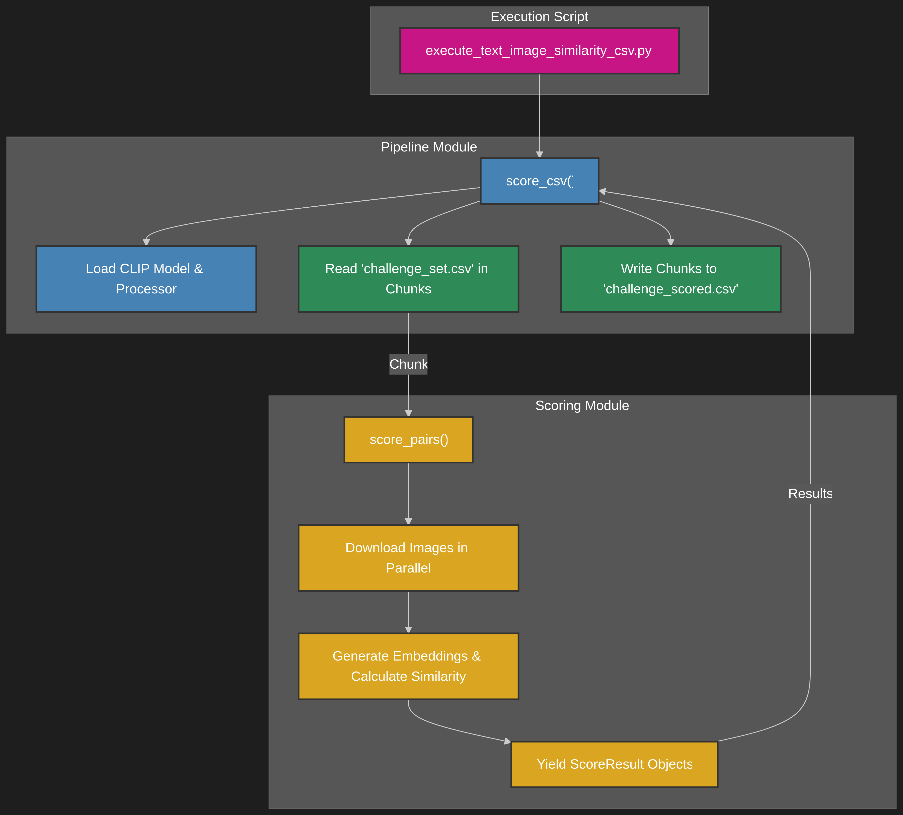
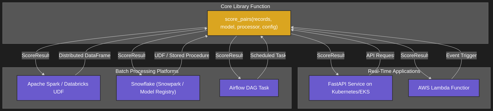

# ML Challenge – Text–Image Similarity

This project provides a solution for computing similarity scores between images and text captions, as per the challenge brief.

## Setup and Execution

1.  **Install Dependencies:** Ensure you have Python 3.10+ and Poetry installed. Then, install the project dependencies:
    ```bash
    poetry install
    ```

2.  **Prepare Data:** Place the `challenge_set.csv` file in the root of the project directory.

3.  **Run the Scoring Pipeline:** Execute the main script:
    ```bash
    poetry run python execute_text_image_similarity_csv.py
    ```

This will generate a `challenge_scored.csv` file with `similarity` and `error` columns.

---

## Question 1: Code to Compute the Similarity Metric

The code is packaged as a reusable Python library in the `text_image_similarity` directory.

### Core Logic

The main logic is in the `score_pairs` function, which takes an iterable of `Record` objects and returns an iterable of `ScoreResult` objects. It performs the following steps:
1.  **Concurrent Image Downloading:** Downloads images in parallel using a `ThreadPoolExecutor`.
2.  **Preprocessing:** Prepares images and text for the `openai/clip-vit-base-patch32` model. I chose CLIP ViT-B/32 for a fast, deterministic, self-hostable dual-encoder that batch-scores cheaply today; if we need higher accuracy later, we can swap to SigLIP/OpenCLIP/EVA or add a cross-encoder/VLM reranker without changing the pipeline.
3.  **Embedding Generation:** Generates vector embeddings for images and text.
4.  **Similarity Calculation:** Computes the cosine similarity, normalizes it to a 0-1 range, and rounds to four decimal places.

### Execution Flow

The diagram below illustrates the flow for the provided CSV script.



---

## Question 2: Time/Memory Footprint and Optimisation Strategies

### Time and Memory Footprint

- **Memory:**
  The CLIP `ViT-B/32` model requires roughly **600 MB** of RAM/VRAM.
  Memory usage grows primarily with **batch size**, since more images and captions are held in memory simultaneously.
  The pipeline itself streams CSV data in chunks, keeping the overall memory footprint stable and predictable.

- **Time:**
  The main bottlenecks are:
  1. **Image Downloading (I/O-bound):** Dependent on network latency and image size.
  2. **Model Inference (compute-bound):** Forward passes through the CLIP model; significantly faster on GPU compared to CPU.

### Optimisation Strategies

- **Concurrent I/O (Implemented):**
  Images are downloaded in parallel using a `ThreadPoolExecutor`, reducing wait time on network-bound operations.

- **Batching (Implemented):**
  Records are processed in batches, enabling the model to exploit GPU parallelism and minimise per-sample overhead.

- **Hardware Acceleration & FP16 (Supported):**
  The system can auto-detect GPUs (`cuda`, `mps`) and run in half precision (`fp16`) for faster inference and lower VRAM use, where supported.

- **Additional Future Optimisations:**
  - **Quantisation:** Convert weights to INT8 for reduced memory footprint and faster CPU inference.
  - **Distillation:** Train a smaller “student” model to approximate CLIP’s performance with lower compute cost.
  - **Caching:** Cache downloaded images and/or embeddings to avoid repeated downloads or re-computation for duplicate data.
  - **Distributed Inference:** Use frameworks like **Triton/KServe/Ray Serve** to parallelise inference across multiple GPUs/nodes for large-scale throughput.

---

## Question 3: Packaging and Deployment at Scale

### Packaging

**Package once, run everywhere.**

- **Library:** `poetry build` → wheel (`dist/text_image_similarity-*.whl`) installable via `pip/poetry` in jobs or services.
- **Container:** Docker image that includes the wheel and runtime deps (`torch`, `fastapi`, etc.).
  - Publish to a registry (e.g., **Amazon ECR**, GitHub Container Registry, or GCP Artifact Registry).
  - The wheel itself can also be stored in **AWS CodeArtifact** or ECR for **proper versioning control** and traceability across environments.
- These artifacts are then deployed to Kubernetes or used in batch/data processing platforms.

### Deployment Architecture for Millions of Daily Requests

A robust architecture must handle both real-time (online) and batch (offline) processing.



#### Real-Time Inference

For on-demand scoring with low latency:

-   **FastAPI on Kubernetes (e.g., EKS, GKE):** The library would be wrapped in a **FastAPI** service. This service would be containerised with **Docker** and deployed to a **Kubernetes** cluster. A **Horizontal Pod Autoscaler (HPA)** would automatically scale the number of GPU-enabled pods based on traffic. An API Gateway would manage requests, authentication, and rate limiting.
-   **AWS Lambda:** For serverless deployments, the library can be packaged into a Lambda function. Because the model is large, it would be stored on **Amazon EFS** (Elastic File System) and mounted by the Lambda function at runtime. This pattern is cost-effective for sporadic traffic.

#### Batch Processing (Offline)

For processing millions of records efficiently:

-   **Apache Spark (Databricks, EMR):** The library's wheel file can be installed on a Spark cluster. The `score_pairs` function would be wrapped in a **User-Defined Function (UDF)**, allowing it to be applied to a Spark DataFrame in a distributed manner, processing massive datasets in parallel.
-   **Snowflake:** The library can be integrated with **Snowpark**. The model would be uploaded to the **Snowflake Model Registry**, and the scoring logic would be deployed as a secure UDF or Stored Procedure. This allows users to run the similarity scoring directly within their SQL queries on data stored in Snowflake.
-   **Airflow:** For orchestrating recurring batch jobs, an **Airflow DAG** would be created. A task within the DAG would install the library, fetch a batch of records from a database or data lake, run the scoring process on a dedicated compute instance (e.g., an EC2 instance), and write the results back.

#### Observability & Operations

-   **Metrics & Dashboards:** Expose Prometheus metrics (RPS, p50/p95/p99 latency, error rate, batch size, queue depth, GPU util); visualise in Grafana.
-   **Health Checks:** Implement `/healthz` (liveness) and `/readyz` (readiness) endpoints to ensure traffic is only routed to healthy, ready-to-serve application instances.
-   **CI/CD & IaC:**
    -   **CI:** A continuous integration pipeline would run tests, build/scan the Python wheel and Docker image, and push the artifacts to a registry.
    -   **CD:** Continuous deployment would be managed via Helm and Argo Rollouts for canary or blue-green deployments.
    -   **IaC:** The infrastructure (Kubernetes cluster, container registry, load balancers, etc.) would be managed as code using Terraform.
    -   **Cost Tracking:** Integrate with cloud cost monitoring tools (e.g., AWS Cost Explorer, GCP Billing, Kubecost) to attribute GPU/CPU usage per service and optimise spend at scale.


#### Future Optimisations (Roadmap)

-   **Quantisation:**
    -   **CPU:** Use ONNX Runtime with INT8 dynamic quantisation for a ≈1.5–3× speed-up.
    -   **GPU:** Compile the model to a TensorRT engine with FP16/INT8 precision for maximum throughput.
-   **Caching:**
    -   **HTTP/Image Cache:** Use a CDN or a reverse proxy like Nginx to cache frequently accessed images.
    -   **Embedding/Result Cache:** Implement a Redis or Memcached layer to cache results for identical (URL, caption) pairs, keyed by a hash of the inputs.
-   **Model Distillation:** Train a smaller, faster "student" model to mimic the behavior of the larger CLIP model, reducing latency and VRAM requirements with a minimal trade-off in accuracy.
-   **Distributed Inference:** For extremely high throughput, use a dedicated inference server like Triton, KServe, or Ray Serve to manage multi-GPU inference and sharding.
